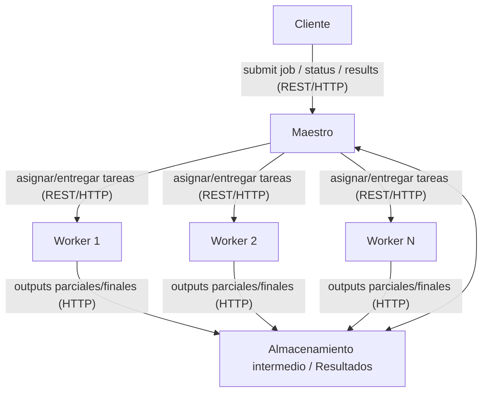

# Informe Técnico – Proyecto GridMR
---

## 1. Descripción del servicio y problema abordado

El proyecto **GridMR** consiste en el diseño e implementación de un sistema de procesamiento distribuido basado en el paradigma **MapReduce**, ejecutado sobre una red de nodos heterogéneos y débilmente acoplados (**Grid Computing**). Este proyecto está inspirado principalmente en el diseño e implementación de MapReduce en **Hadoop** y **Apache Spark**.

El servicio permitirá que un **cliente externo** envíe trabajos intensivos en datos y cómputo, los cuales serán planificados y ejecutados de manera distribuida por un conjunto de nodos. El objetivo es realizar procesamiento distribuido en diferentes tipos de tareas MapReduce, que incluyen **análisis estadístico**, **indexación de documentos**, **cálculo de PageRank** y **simulaciones físicas**.

### **Requisitos funcionales**

- El cliente debe poder enviar un “programa MapReduce” que incluya las funciones `map()` y `reduce()`, los datos de entrada y los parámetros básicos como el tamaño de los splits y el número de reducers.
- El nodo maestro debe recibir la solicitud, dividir los datos en fragmentos (*splits*) y distribuirlos entre los workers.
- Los workers ejecutan la función `map()` definida por el cliente.
    - Ejemplo: En WordCount, `map()` toma un fragmento de texto y emite pares `(palabra, 1)`.
- Los resultados intermedios se recolectan, particionan y se envían a otros workers para que ejecuten `reduce()`.
    - Ejemplo: En WordCount, `reduce()` suma las ocurrencias y devuelve `(palabra, total)`.
- Finalmente, los resultados consolidados se ponen a disposición del cliente mediante un archivo de salida o una API.

### **Requisitos no funcionales**

- **Escalabilidad:** El sistema debe mejorar su desempeño a medida que se agregan más nodos.
- **Tolerancia a fallos:** El maestro debe detectar fallos de nodos y reasignar tareas.
- **Eficiencia:** El sistema debe minimizar las transferencias de datos innecesarias y balancear la carga entre nodos.
- **Flexibilidad:** El sistema debe permitir la definición de diferentes tipos de trabajos MapReduce.
- **Reproducibilidad:** Los resultados de un mismo trabajo deben ser consistentes sin importar la distribución de nodos.
- **Simplicidad operativa:** El sistema debe ser capaz de ejecutarse en VMs o contenedores Docker, asegurando una fácil implementación.

---

## 2. Arquitectura del sistema y diagramas

### **Tipo de arquitectura**

Se adopta un modelo **Cliente/Servidor con patrón Maestro–Trabajador (Master–Workers)**:

- **Cliente:** El cliente envía trabajos MapReduce y consulta resultados.
- **Maestro:** Planifica y asigna tareas, gestiona los workers, maneja fallos y consolida resultados.
- **Workers:** Ejecutan funciones `map()` o `reduce()`, procesan los datos y reportan el estado y los resultados.

Este modelo es ideal porque:

- Se ajusta al paradigma **MapReduce** con un planificador central (maestro) y múltiples ejecutores paralelos (workers).
- Permite **escalar fácilmente** añadiendo más workers.
- Facilita la **tolerancia a fallos** mediante heartbeats y reasignación de tareas.
- Simplifica la evaluación y demostración mediante un único punto de coordinación.

### **Tecnologías**

- **Ejecución:** Docker se utiliza para encapsular cada nodo (maestro y workers) sobre un sistema operativo **Linux**, asegurando la reproducibilidad y el aislamiento de los nodos.
- **Lenguaje:** Se usa **Python 3.10+** para la lógica del sistema, con **FastAPI** para implementar las APIs REST. Este enfoque es adecuado debido a la facilidad de desarrollo y la disponibilidad de bibliotecas para manipulación de datos y pruebas.
- **Infraestructura:** El sistema está diseñado para ejecutarse en **máquinas virtuales (VMs)** en **AWS Academy** o en entornos Docker locales.

### **Comunicaciones**

- **Cliente ↔ Maestro:** REST sobre HTTP con **JSON** como formato de comunicación. Esto facilita la interoperabilidad y la depuración.
- **Maestro ↔ Workers:** El maestro asigna tareas mediante un modelo *pull*, donde los workers solicitan las tareas de forma eficiente. La comunicación también es REST sobre HTTP.
- **Entre Workers:** En esta versión inicial, no se requiere comunicación directa entre workers; los datos intermedios se manejan a través de almacenamiento accesible por HTTP.

### **Diagrama lógico**

## 3. Especificación de protocolos y APIs

### **Cliente ↔ Maestro**

- **REST/HTTP + JSON**
    - `POST /jobs/submit`: Enviar un job MapReduce con los parámetros correspondientes.
    - `GET /jobs/{id}/status`: Consultar el estado de un job.
    - `GET /jobs/{id}/results`: Obtener los resultados consolidados de un job.

### **Maestro ↔ Workers**

- **REST/HTTP + JSON**
    - `POST /workers/register`: El worker se registra en el maestro.
    - `POST /workers/heartbeat`: El worker informa su estado al maestro (ej. carga de trabajo actual).
    - `POST /tasks/pull`: El worker solicita tareas al maestro.
    - `POST /tasks/{id}/done`: El worker informa al maestro que ha completado la tarea.

### **Entre Workers**

- **MVP:** No hay comunicación directa entre los workers. Los datos intermedios se almacenan en un lugar central accesible por HTTP.

---

## 4. Algoritmos de planificación

El nodo maestro debe:

1. **Dividir los datos** en fragmentos (*splits*) según el tamaño definido por el parámetro `split_size`.
2. **Asignar tareas Map** a los workers disponibles. La asignación se basa en la disponibilidad reportada en los heartbeats, la capacidad simulada de cada worker y el balance de carga.
3. **Recolectar resultados intermedios** (salidas de los Map).
4. **Particionar los resultados** y asignar las tareas Reduce correspondientes.
5. **Consolidar resultados finales** y ponerlos a disposición del cliente.
6. **Manejo de fallos:** Si un worker no responde, las tareas asignadas a ese worker se reasignan automáticamente a otros workers disponibles.

---

## 5. Descripción del entorno de ejecución

El sistema debe ejecutarse en **máquinas virtuales (VMs)** de **AWS Academy** o en contenedores Docker locales, con las siguientes características:

- **Cada nodo (maestro o worker)** debe estar aislado en su propio contenedor Docker o máquina virtual, con puertos expuestos para la comunicación entre nodos.
- **Cada nodo expone una API REST** para recibir, procesar y reportar tareas.

### **Escenarios de despliegue**

- **Local:** Uso de `docker-compose` para simular varios nodos en una sola máquina.
- **Distribuido:** Despliegue en AWS Academy con máquinas virtuales (VMs) y contenedores Docker, conectados entre sí mediante puertos expuestos.

---
